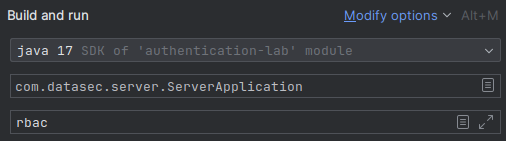
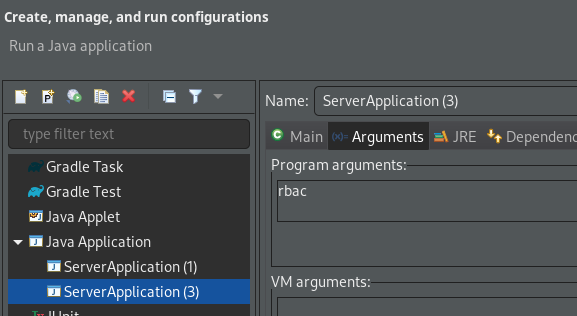

# 02239 Data Security - Lab Assignment 3

## Prerequisites

* Java JDK 17.0 or newer
* IntelliJ Idea >= 2020 or Eclipse*

## User credentials for testing

The default database users:

`alice, bob, cecilia, david, erica, fred, george, henry, ida`

Password: `<Username>123`

For example: `alice123`

### Using IntelliJ (recommended)

Choose `File -> Open` and browse to this directory. Click OK.

#### Start Print server

Open file `src/java/com/datasec/server/ServerApplication.java`

Click `Run 'ServerApplication.java'`

The default authorization method is ACL. To change method to RBAC pass `rbac` as input to the program.

IntelliJ build and run configuration:

 

#### Client Application

Then start the client GUI by:

Open file `src/java/com/datasec/client/ClientApplication.java`

Click `Run 'ClientApplication'`

### Using Eclipse

Download `lombok` here:

`https://repo1.maven.org/maven2/org/projectlombok/lombok/1.18.30/lombok-1.18.30.jar`

Run the installer:

`java -jar lombok-1.18.30.jar`

Open Eclipse and click `File -> Open Projects from File System`

Browse to this directory and click Finish.

Open file `src/java/com/datasec/server/ServerApplication.java`

Right click on file and choose `Run as Java Application`

The default authorization method is ACL. To change method to RBAC pass `rbac` as input to the program.

Eclipse run configuation:

Start the client GUI by running `src/java/com/datasec/client/ClientApplication`

## Github project

[https://github.com/marcosantiagomuro/02239-access-control-lab](https://github.com/marcosantiagomuro/02239-access-control-lab)
